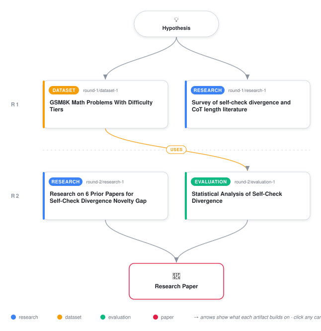

# Longer Reasoning Chains Reduce Self-Check Agreement in Language Models

<div align="center">

<a href="https://cdn.jsdelivr.net/gh/ai-inventor-outputs/ai-invention-febf9b-longer-reasoning-chains-reduce-self@main/workflow.svg">
<picture>
  <source media="(prefers-color-scheme: dark)" srcset="workflow-dark.svg">
  
</picture>
</a>

<sub>🖱️ <b><a href="https://cdn.jsdelivr.net/gh/ai-inventor-outputs/ai-invention-febf9b-longer-reasoning-chains-reduce-self@main/workflow.svg">Open the interactive diagram</a></b> — every card links to its artifact folder.</sub>

</div>

> **TL;DR** — First empirical measurement of self-check divergence: long CoT traces produce 20.8 percentage-point drop in agreement rate vs. medium CoT (54.8% vs. 75.6%), with medium effect size. Agreement follows inverted-U pattern mirroring accuracy, not monotonic decline. Consistency-accuracy gap reveals short CoT is accurate but inconsistent, while long CoT is both inaccurate and irreproducible.

<details>
<summary>Full hypothesis</summary>

Self-check agreement between a model's CoT-derived answer and its independent re-evaluation follows an inverted-U curve as a function of reasoning length: medium-length CoT maximizes both accuracy and internal consistency, while short CoT produces fragile reasoning (high accuracy but low reproducibility) and long CoT produces systematic error accumulation (low accuracy and low agreement). This 'self-check divergence' — defined as the decrease in agreement rate when CoT length exceeds the optimal point — reveals a consistency-accuracy gap that tracks the reliability of self-verification pipelines. The effect is predicted to be strongest for hard problems where long reasoning is most needed, and should generalize across model families and reasoning domains, though preliminary evidence is limited to a single 3B-parameter model on mathematical word problems.

</details>

[](https://cdn.jsdelivr.net/gh/ai-inventor-outputs/ai-invention-febf9b-longer-reasoning-chains-reduce-self@main/paper.pdf) [](https://github.com/ai-inventor-outputs/ai-invention-febf9b-longer-reasoning-chains-reduce-self/tree/main/paper_latex)

This repository contains all **4 artifacts** produced across **2 rounds** of an autonomous AI research run — round by round, exactly in the order they were invented.

## Round 1

| Artifact | Type | Demo | Source | Builds on |
|----------|------|------|--------|-----------|
| **[Survey of self-check divergence and CoT length literature](https://github.com/ai-inventor-outputs/ai-invention-febf9b-longer-reasoning-chains-reduce-self/tree/main/round-1/research-1)** | [](https://github.com/ai-inventor-outputs/ai-invention-febf9b-longer-reasoning-chains-reduce-self/tree/main/round-1/research-1) | [](https://github.com/ai-inventor-outputs/ai-invention-febf9b-longer-reasoning-chains-reduce-self/blob/main/round-1/research-1/demo/research_demo.md) | [](https://github.com/ai-inventor-outputs/ai-invention-febf9b-longer-reasoning-chains-reduce-self/tree/main/round-1/research-1/src) | — |
| **[GSM8K Math Problems With Difficulty Tiers](https://github.com/ai-inventor-outputs/ai-invention-febf9b-longer-reasoning-chains-reduce-self/tree/main/round-1/dataset-1)** | [](https://github.com/ai-inventor-outputs/ai-invention-febf9b-longer-reasoning-chains-reduce-self/tree/main/round-1/dataset-1) | [](https://colab.research.google.com/github/ai-inventor-outputs/ai-invention-febf9b-longer-reasoning-chains-reduce-self/blob/main/round-1/dataset-1/demo/data_code_demo.ipynb) | [](https://github.com/ai-inventor-outputs/ai-invention-febf9b-longer-reasoning-chains-reduce-self/tree/main/round-1/dataset-1/src) | — |

## Round 2

| Artifact | Type | Demo | Source | Builds on |
|----------|------|------|--------|-----------|
| **[Research on 6 Prior Papers for Self-Check Divergence Novelty…](https://github.com/ai-inventor-outputs/ai-invention-febf9b-longer-reasoning-chains-reduce-self/tree/main/round-2/research-1)** | [](https://github.com/ai-inventor-outputs/ai-invention-febf9b-longer-reasoning-chains-reduce-self/tree/main/round-2/research-1) | [](https://github.com/ai-inventor-outputs/ai-invention-febf9b-longer-reasoning-chains-reduce-self/blob/main/round-2/research-1/demo/research_demo.md) | [](https://github.com/ai-inventor-outputs/ai-invention-febf9b-longer-reasoning-chains-reduce-self/tree/main/round-2/research-1/src) | — |
| **[Statistical Analysis of Self-Check Divergence](https://github.com/ai-inventor-outputs/ai-invention-febf9b-longer-reasoning-chains-reduce-self/tree/main/round-2/evaluation-1)** | [](https://github.com/ai-inventor-outputs/ai-invention-febf9b-longer-reasoning-chains-reduce-self/tree/main/round-2/evaluation-1) | [](https://colab.research.google.com/github/ai-inventor-outputs/ai-invention-febf9b-longer-reasoning-chains-reduce-self/blob/main/round-2/evaluation-1/demo/eval_code_demo.ipynb) | [](https://github.com/ai-inventor-outputs/ai-invention-febf9b-longer-reasoning-chains-reduce-self/tree/main/round-2/evaluation-1/src) | <sub><i>uses:</i><br/>[dataset‑1&nbsp;(R1)](https://github.com/ai-inventor-outputs/ai-invention-febf9b-longer-reasoning-chains-reduce-self/tree/main/round-1/dataset-1)</sub> |

## Repository Structure

Artifacts are grouped by the round of invention that produced them. Each
artifact has its own folder with source code and a self-contained demo:

```
.
├── round-1/                         # One folder per round of invention
│   ├── experiment-1/
│   │   ├── README.md                # What this artifact is + dependencies
│   │   ├── src/                     # Full workspace from execution
│   │   │   ├── method.py            # Main implementation
│   │   │   ├── method_out.json      # Full output data
│   │   │   └── ...                  # All execution artifacts
│   │   └── demo/                    # Self-contained demo
│   │       └── method_code_demo.ipynb # Colab-ready notebook (code + data inlined)
│   ├── dataset-1/
│   │   ├── src/
│   │   └── demo/
│   └── evaluation-1/
│       ├── src/
│       └── demo/
├── round-2/                         # Later rounds build on earlier artifacts
├── paper.pdf                        # Research paper
├── paper_latex/                     # LaTeX source files
├── workflow.svg                     # Artifact dependency diagram (this page's header)
└── README.md
```

## Running Notebooks

### Option 1: Google Colab (Recommended)

Click the "Open in Colab" badges above to run notebooks directly in your browser.
No installation required!

### Option 2: Local Jupyter

```bash
# Clone the repo
git clone https://github.com/ai-inventor-outputs/ai-invention-febf9b-longer-reasoning-chains-reduce-self
cd ai-invention-febf9b-longer-reasoning-chains-reduce-self

# Install dependencies
pip install jupyter

# Run any artifact's demo notebook
jupyter notebook <artifact_folder>/demo/
```

## Source Code

The original source files are in each artifact's `src/` folder.
These files may have external dependencies - use the demo notebooks for a self-contained experience.

---
*Generated by AI Inventor Pipeline - Automated Research Generation*
